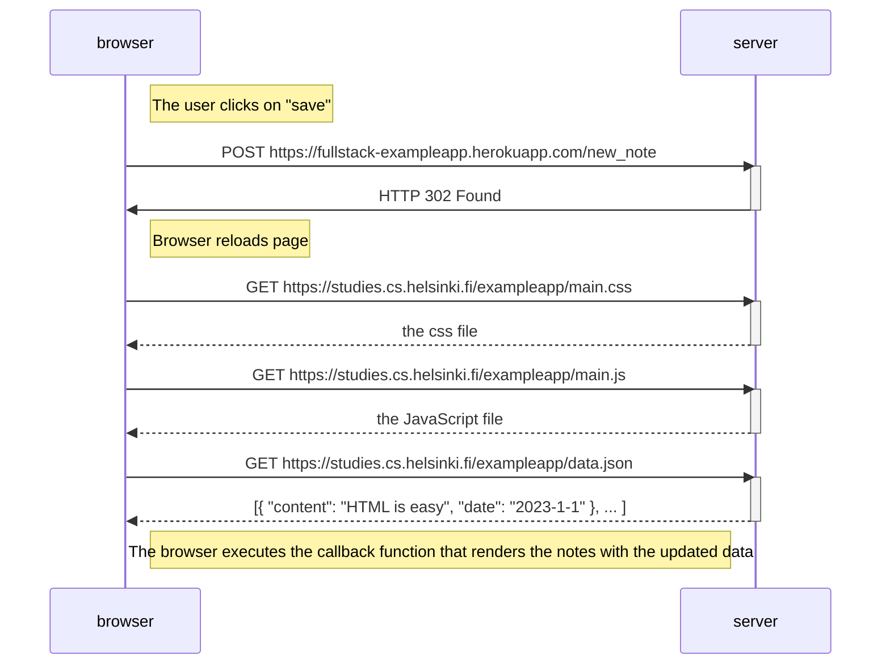

```mermaid
	sequenceDiagram
    participant browser
    participant server
	
	Note right of browser: The user clicks on "save"
	
	browser->>server: POST https://fullstack-exampleapp.herokuapp.com/new_note
	activate server
	server->>browser: HTTP 302 Found
	deactivate server
	
	Note right of browser: Browser reloads page
	
	browser->>server: GET https://studies.cs.helsinki.fi/exampleapp/main.css
    activate server
    server-->>browser: the css file
    deactivate server

    browser->>server: GET https://studies.cs.helsinki.fi/exampleapp/main.js
    activate server
    server-->>browser: the JavaScript file
    deactivate server
	
	browser->>server: GET https://studies.cs.helsinki.fi/exampleapp/data.json
    activate server
    server-->>browser: [{ "content": "HTML is easy", "date": "2023-1-1" }, ... ]
    deactivate server
	
	Note right of browser: The browser executes the callback function that renders the notes with the updated data
```