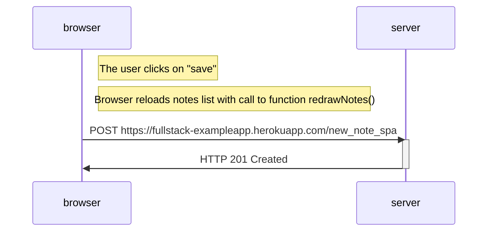

```mermaid
	sequenceDiagram
    participant browser
    participant server
	
	Note right of browser: The user clicks on "save"
	
	Note right of browser: Browser reloads notes list with call to function redrawNotes()
	
	browser->>server: POST https://fullstack-exampleapp.herokuapp.com/new_note_spa
	activate server
	server->>browser: HTTP 201 Created
	deactivate server
```